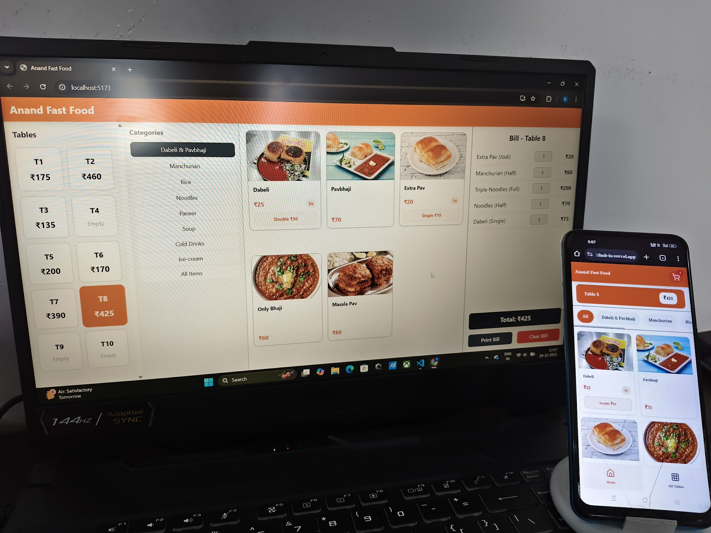
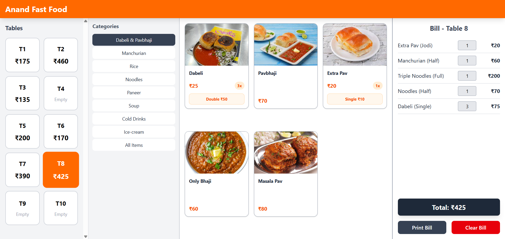
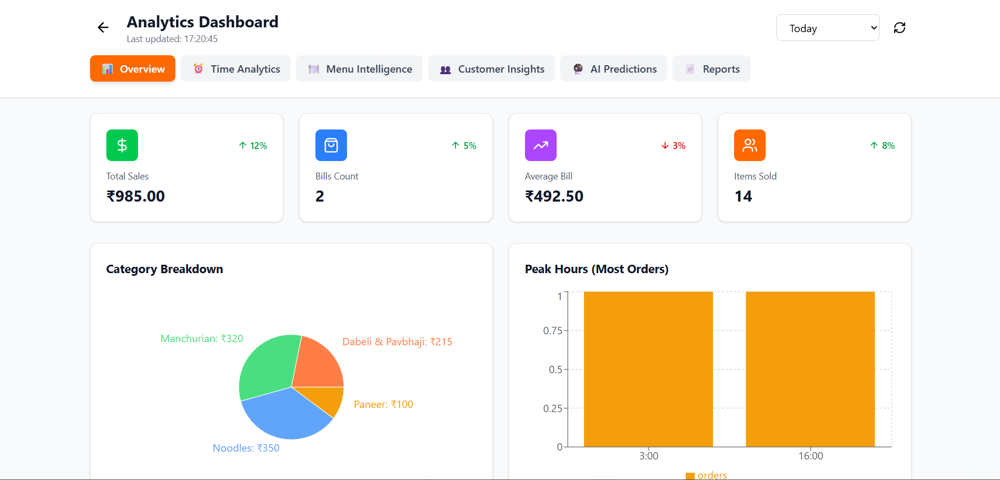
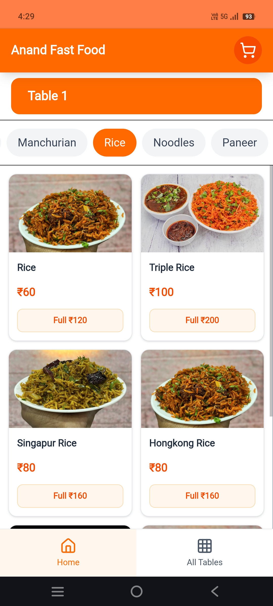
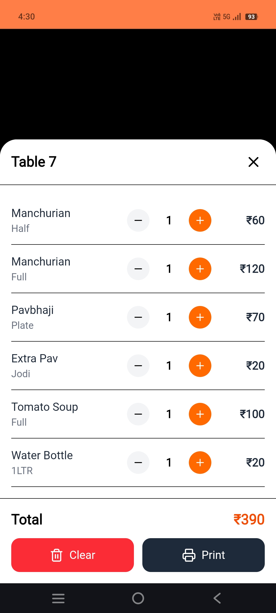
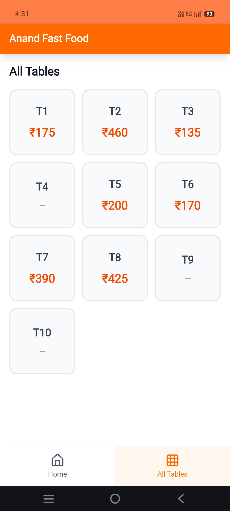

# 🍽️ Anand Fast Food POS — Real-Time Restaurant Billing System
> Fast, portion-based POS with multi-table totals, realtime sync & installable PWA.  
> Built for **Anand Fast Food** (my dad’s business) — tested in daily real-world usage.


---

## 📌 Overview

Anand Fast Food POS is designed to solve **real restaurant problems** — speed during rush hours, quick switching between tables, and clean item selection using **portion-based ordering**.

Unlike traditional billing apps, this system:
- keeps menu clutter-free  
- lets staff add items in *one tap*  
- shows all running table totals *at once*  
- syncs across devices *instantly*  

This setup has reduced ordering time and confusion in daily operations at Anand Fast Food.

---

## 🎯 **Key Differentiators (Real-world advantages)**

🍽️ Portion-based ordering
One item, multiple sizes (Half / Full, Small / Large)
Default portion adds with a single tap → faster billing & cleaner menu

📊 All Tables view
Shows every table’s running total in one screen
Helps staff monitor and switch between tables quickly

🔁 Realtime sync (Supabase)
Changes made on one device appear instantly on all others
No manual refresh needed

📱 Installable PWA
Works like a native app on phones & tablets
Add to home screen, runs full-screen, offline-friendly

📦 Offline queueing
If internet goes down, orders are saved locally
Syncs automatically once connection returns

⚡ Optimistic UI updates
Items show up instantly before backend confirmation
Keeps the app responsive during rush hours
---

## 🎥 Demo Highlights

- Add items to **Table 1** using 1-tap default portions
- Switch to **Table 5** — continue ordering seamlessly
- Open **Cart drawer** — review orders instantly
- Navigate to **All Tables** — view all totals at once
- Select **Table 1** → **Clear Bill** — auto-saved for analytics

> This matches how staff work during busy hours: *tap → serve → switch tables → continue.*

---

## 🧠 Why Portions Matter

A portion is a **variant of the same item** with different quantity & price —  
but grouped under *one clean item card.*

- **1 tap** adds the most common portion  
- extra portion buttons appear only if needed  
- less scrolling, less confusion, faster ordering

Paneer Fry → Half / Full

Rice → Plate / Half

Juice → Small / Large


## 📸 Screenshots

### 🖥️ Desktop + Mobile Side-by-Side


### 💻 Desktop — Active Bill


### 📊 Dashboard (Analytics)


### 📱 Mobile — Rice Category Selected


### 📱 Mobile — Cart Drawer (Table 7)


### 📱 Mobile — All Tables Overview


---

## 💻 Tech Stack


| UI      - React, Tailwind |

| Backend - Supabase, PostgreSQL |

| Sync    - Supabase Realtime |

| Offline - Service Worker, IndexedDB Queue |

| App Experience  -- PWA Install, Mobile-first layout |

---

## 🛠 Installation

```bash
git clone https://github.com/Suryaa-Dev/restuarent-bill-generator.github.io
cd restuarent-bill-generator.github.io
npm install
npm run dev

📦 Environment

Create .env:

VITE_SUPABASE_URL=your_url
VITE_SUPABASE_ANON_KEY=your_key
